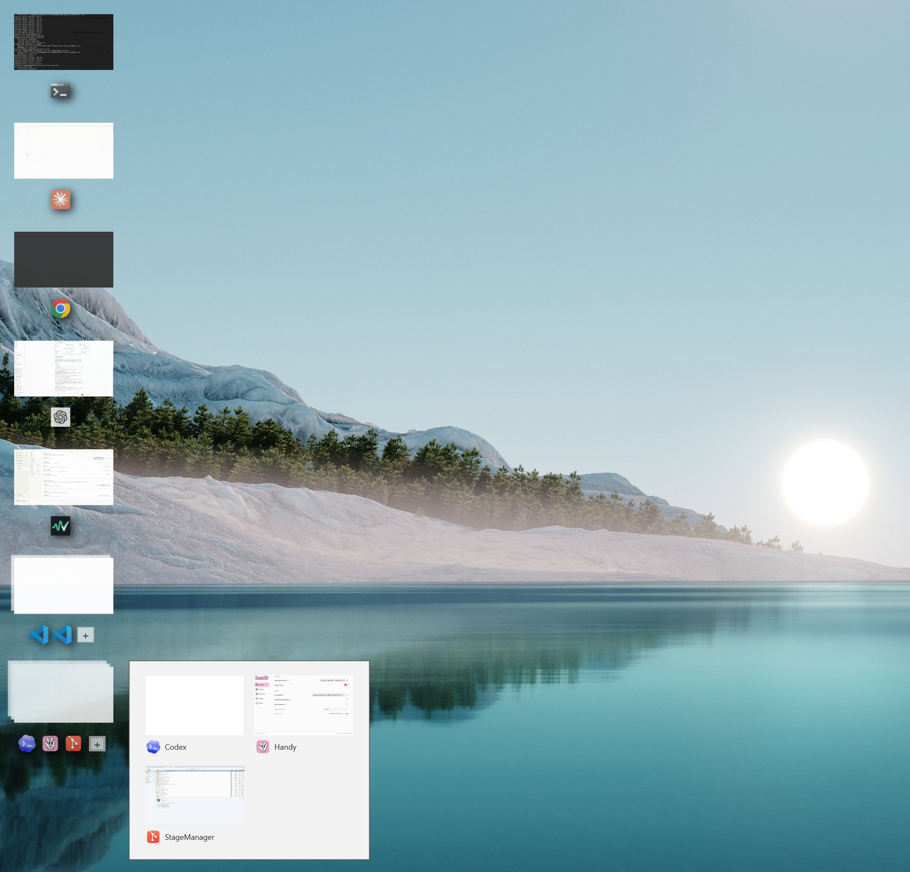
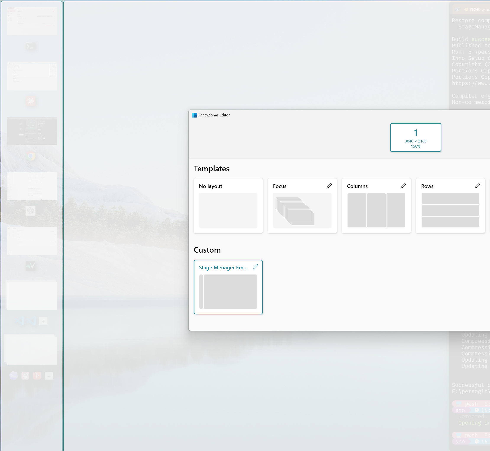

# Stage Manager for Windows

This project is a fork of the original, not updated for 3 years (as of 06/2026), [awaescher/StageManager](https://github.com/awaescher/StageManager) prototype, bringing the macOS [Stage Manager](https://support.apple.com/en-us/HT213315) experience to Windows.

This fork introduces support for **multiple virtual workspaces (desktops)**, **application window grouping**, and crucial bug fixes to make the application more stable, polished, and production-ready.

## Recommended Companion Setup

For the best day-to-day experience, use StageManager together with [PowerToys FancyZones](https://learn.microsoft.com/en-us/windows/powertoys/fancyzones). FancyZones keeps your main work area predictable while StageManager keeps the current app/window set easy to switch from the side.

## Key Improvements & Fixes in this Fork

- **Virtual Desktop Support**: Fully resolved window tracking and identification issues when using multiple virtual desktops.
- **Window Grouping**: Added support for grouping windows by application/process.
- **Modernized Codebase**: Upgraded to **.NET 10** and refactored the codebase to use modern C# language features.
- **Tray Icon Integration**: Added a system tray icon to easily control, start, stop, and exit the application.
- **Visual Polish & Micro-Animations**: Added smooth scale-up animations on hover, natural icon tilt offsets, and improved live DWM thumbnail selection.
- **CI/CD & Installer**: Added an Inno Setup installer script (`installer/StageManager.iss`), a publication script (`publish.ps1`), and GitHub Actions release workflows for automated builds.

## Usage

Download the latest installer or:
- Clone this repository
- `cd` into the repository directory
- Run `dotnet run --project StageManager`

To quit, find the app's tray icon (Windows might move it into the overflow menu) and use its context menu to close the app.
 
### Requirements
- Windows 10 version 2004 or newer
- [.NET 10 SDK](https://dotnet.microsoft.com/en-us/download)

---

Stage Manager is using a few code files to handle window tracking from [workspacer](https://github.com/workspacer/workspacer), an amazing open source project by [Rick Button](https://github.com/rickbutton).
